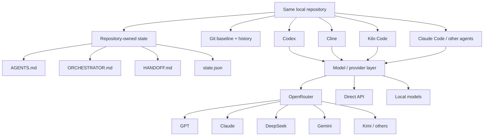

# Portable Agent Workspace

**Your repository owns the state. Your AI coding agent is replaceable.**

Portable Agent Workspace is a lightweight pattern for continuing the **same local coding project** across different AI coding agents, IDE extensions, and model providers without moving the repository or re-explaining the project from scratch.

> When one agent runs out of tokens, another one clocks in.

## Why this exists

AI coding agents often keep important project context inside one chat, session, or provider. That creates a fragile dependency: if an agent hits a usage limit, loses context, or you want to switch models, the project can become difficult to resume safely.

This repository demonstrates a different approach:

- keep long-lived project truth **inside the repo**;
- keep short-lived execution state in a compact handoff file;
- use Git as a known-good baseline and audit trail;
- make agent instructions provider-neutral;
- treat Codex, Claude, GPT, DeepSeek, Gemini, Kimi, and future models as replaceable workers.

## Core idea

```text
Codex available
    ↓
work normally
    ↓
quota exhausted
    ↓
open the SAME repository in another coding agent
    ↓
recover state from repository files + Git
    ↓
continue with another model/provider
    ↓
checkpoint
    ↓
return to Codex later and resume
```

## Core files

A portable repo should contain at least:

```text
AGENTS.md                 # universal onboarding / resume protocol
ORCHESTRATOR.md           # provider-neutral execution rules
HANDOFF.md                # short-lived current-state summary
orchestration/state.json  # machine-readable execution state
Git history               # known-good baseline + diffs
```

Templates are included in this repository.

## Recommended resume sequence

Every new coding agent should recover the project in the same order:

```text
AGENTS.md
→ ORCHESTRATOR.md
→ HANDOFF.md
→ orchestration/state.json
→ relevant product / architecture / ADR docs
→ git status
→ git log
→ current authorized task
```

The new agent should not need the previous model's conversation history.

## Tested setups

These are **observations from one real portability experiment**, not permanent compatibility guarantees. Tooling changes quickly.

| Harness / environment | Model | Provider | Observed result |
|---|---|---|---|
| Codex | GPT family | ChatGPT | ✅ Original workspace |
| Roo Code | — | OpenRouter | ⚠️ Extension announced end of active maintenance during testing |
| Cline | GPT-5.6 Sol | OpenRouter | ✅ Repository recovery and tool use succeeded |
| Cline | DeepSeek V4.1 Flash | OpenRouter | ⚠️ Repeated tool-call / DSML parsing failures observed |
| Kilo Code | DeepSeek V4.1 Flash | OpenRouter | ✅ File tools succeeded |
| Kilo Code | DeepSeek V4.1 Flash | OpenRouter | ✅ Full repository-state recovery succeeded |
| Kilo Code | DeepSeek V4.1 Flash | OpenRouter | 🧪 Execution handoff tested incrementally |

The most important lesson was:

> **Model capability ≠ harness compatibility.**

A model can understand the task perfectly and still fail if the coding harness cannot reliably parse or execute its tool calls.

## Architecture



## Quick start for an existing project

1. Copy the templates from this repository into your project.
2. Customize `AGENTS.md` with your universal resume protocol.
3. Customize `ORCHESTRATOR.md` with your task, safety, and checkpoint rules.
4. Keep `HANDOFF.md` short and current.
5. Persist machine-readable state in `orchestration/state.json`.
6. Create a clean Git baseline before switching agents.
7. Test portability using `prompts/read-only-handoff-test.md`.
8. Only after recovery succeeds, allow the new agent to execute a small, reversible task.

## Safety principle

For a first handoff, prefer **controlled execution**:

- auto-allow reads and searches;
- ask before shell commands;
- ask before edits;
- ask before network access;
- block secrets and `.env` files;
- never allow automatic purchases, data downloads, deployments, or live-order actions unless explicitly intended.

## Repository contents

```text
.
├── README.md
├── AGENTS.example.md
├── ORCHESTRATOR.example.md
├── HANDOFF.example.md
├── orchestration/
│   └── state.example.json
├── prompts/
│   ├── make-existing-repo-portable.md
│   ├── resume-from-another-agent.md
│   ├── checkpoint-before-exit.md
│   └── read-only-handoff-test.md
├── docs/
│   ├── architecture.md
│   ├── handoff-protocol.md
│   ├── harness-comparison.md
│   └── lessons-learned.md
└── examples/
    └── demo-project/
        └── README.md
```

## What this is not

This project does **not** require you to build a custom multi-agent runtime or add model APIs to your application. The first goal is much simpler: make your development repository resumable by different coding agents.

## License

MIT. See `LICENSE`.
